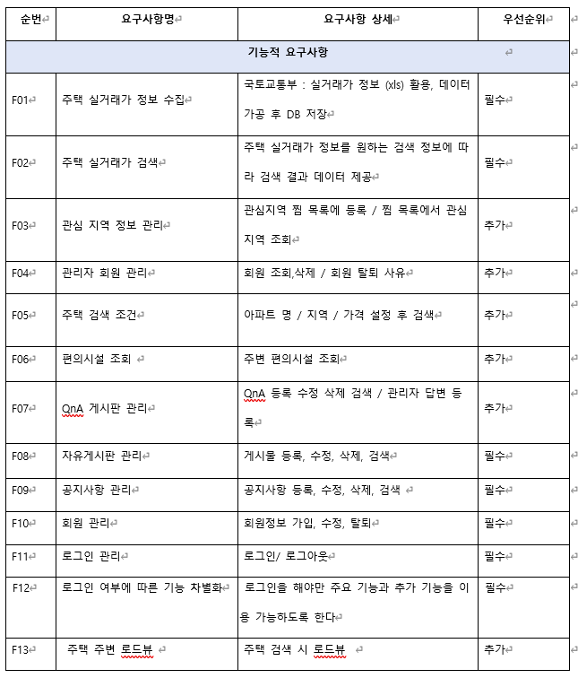

# 구집

공공 데이터를 이용하여 주택 검색을 할 수 있는 프론트앤드 Vue와 백엔드 SpringBoot를 사용한 프로젝트입니다.

2인 프로젝트로서 기능을 중심으로 풀스택으로 개발 했습니다. 아래에 제가 개발한 구현 사항을 나열하겠습니다.

## 구현 사항

- 병원 찾기
- 회원가입/ 로그인 등 유저 관한 기능
- 즐겨 찾기
- 관리자 페이지

## 요구사항 정의서

## Usecase Diagram

## ERD Diagram

## 최종 화면

- **메인**

- **회원가입**

- **내 정보**

- **로그인**

- **찜 목록 ( 즐겨찾기)**

- **집 상세 정보 검색**

- **집 리스트**

- **자유게시판 목록**

- **QnA 게시판**

- **QnA 게시판 상세 보기**

- **게시물 등록**

- **게시물 상세 보기 / 댓글**

- **공지사항**

- **관리자 페이지 회원 관리**

- **관리자 페이지 탈퇴 사유**

## 회고

- 처음 해보는 프로젝트지만 풀스택으로 개발을 해보는 좋은 경험을 했다고 생각합니다.
- 팀원과의 협업의 중요성을 느끼고 개발을 하면서 좋은 팀원을 만나 재밌게 개발할 수 있었습니다.
- GitHub의 사용성과 트렐로와 같은 협업 툴을 익힐 수 있었습니다. (SSAFY 프로젝트로서 GitLab이라 커밋 내역과 깃 자료를 공개 불가능)
- 이 프로젝트는 공공데이터를 사용해서 데이터가 충분했지만 데이터가 부족했다면 개발에도 힘들었을 것 같아 테스트 데이터와 데이터의 중요성을 알 수 있었습니다.
- 프론트앤드 개발 중 API 연결에서 비동기, 자바스크립트에 흥미를 느끼게 되면서 프론트엔드 쪽에 관심을 가지게 되어 향 후에는 React로 웹 프로젝트를 개발할 생각을 갖게 되었습니다.
